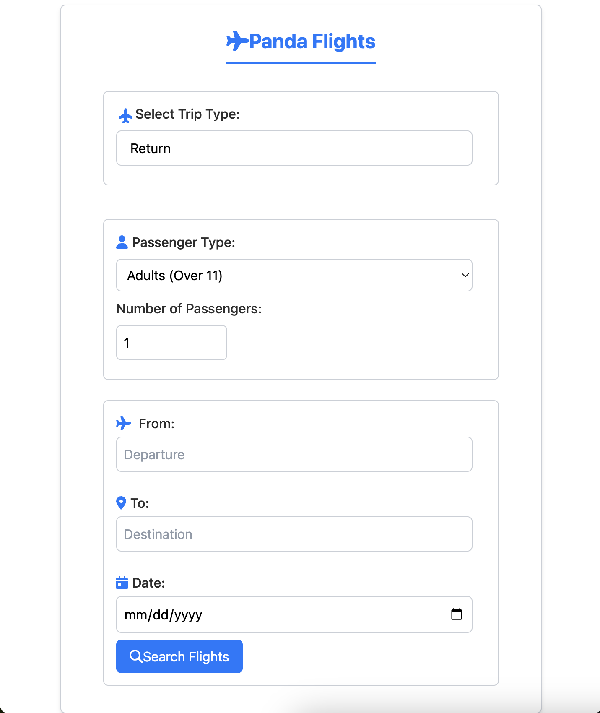

# Flight Reservation App

This is a Flight Reservation App designed to help users find flights based on their preferences.

## Preview 


## Installation

### Prerequisites

- Node.js
- npm or yarn

### Clone the repository

```
git clone <repository_url>
cd flight-reservation-app
```

### Install dependencies
If using npm: 
```
npm install
```

If using Yarn: 
```
yarn install
```

### Running the Application
To start the application: 
If using npm: 
```
npm start
```

If using Yarn: 
```
yarn start
```

### Testing
- Make sure to test each functionality to ensure proper operation.
- Report any issues in the "Issues" tab on GitHub.


### Contributing
If you would like to contribute to the project:

1. Fork the repository.
2. Create your feature branch (`git checkout -b feature/YourFeature`).
3. Commit your changes (`git commit -am 'Add some feature'`).
4. Push to the branch (`git push origin feature/YourFeature`).
5. Open a Pull Request.

